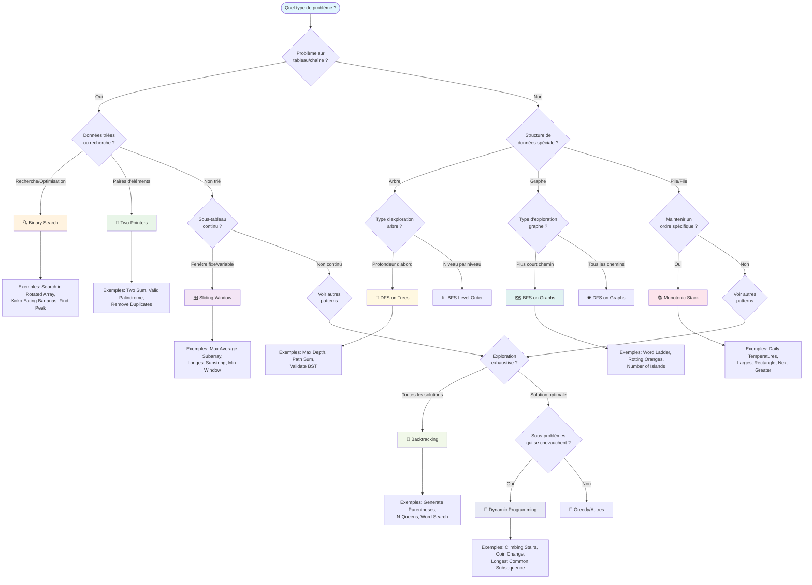
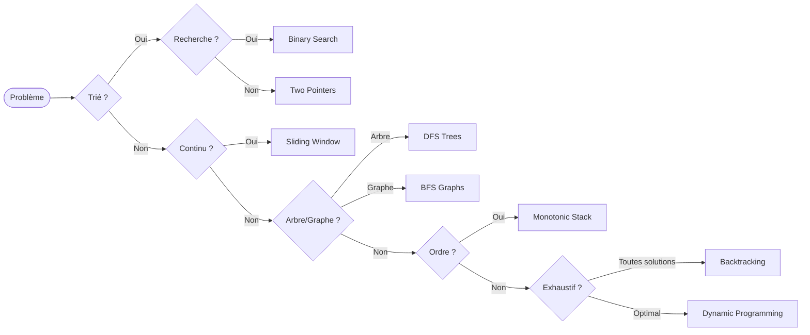

# 🧭 Cheatsheet - Guide de Sélection d'Algorithmes

## 🌳 Arbre de Décision - Quel Pattern Choisir ?



## 🎯 Guide de Questions pour Identifier le Pattern

### 📝 Questions à se poser dans l'ordre :

#### 1️⃣ **Type de données**
- [ ] **Tableau/Chaîne** → Continuer vers questions spécifiques
- [ ] **Arbre** → DFS ou BFS selon le besoin
- [ ] **Graphe** → BFS (plus court chemin) ou DFS (exploration)
- [ ] **Autres structures** → Analyser les opérations nécessaires

#### 2️⃣ **Si tableau/chaîne - Propriétés**
- [ ] **Données triées** → Two Pointers ou Binary Search
- [ ] **Recherche/Optimisation** → Binary Search
- [ ] **Paires d'éléments** → Two Pointers
- [ ] **Sous-tableau continu** → Sliding Window

#### 3️⃣ **Si exploration - Objectif**
- [ ] **Plus court chemin** → BFS
- [ ] **Tous les chemins** → DFS
- [ ] **Niveau par niveau** → BFS
- [ ] **Propriétés d'arbres** → DFS

#### 4️⃣ **Si optimisation - Structure**
- [ ] **Maintenir un ordre** → Monotonic Stack
- [ ] **Sous-problèmes répétés** → Dynamic Programming
- [ ] **Toutes les solutions** → Backtracking
- [ ] **Choix glouton** → Greedy

## 🔍 Matrice de Décision Rapide

| Condition | Pattern | Complexité | Cas d'usage |
|-----------|---------|------------|-------------|
| Tableau trié + paires | Two Pointers | O(n) | Two Sum, Valid Palindrome |
| Fenêtre/sous-tableau | Sliding Window | O(n) | Max Average, Longest Substring |
| Recherche dans trié | Binary Search | O(log n) | Search, Find Peak |
| Next Greater/Smaller | Monotonic Stack | O(n) | Daily Temperatures, Largest Rectangle |
| Parcours d'arbre | DFS on Trees | O(n) | Path Sum, Max Depth |
| Plus court chemin | BFS on Graphs | O(V+E) | Word Ladder, Rotting Oranges |
| Toutes les solutions | Backtracking | O(b^d) | N-Queens, Generate Parentheses |
| Optimisation | Dynamic Programming | O(n²) typique | Coin Change, LCS |

## 🎨 Reconnaissance par Mots-Clés

### 🔍 **Binary Search**
```
✅ "search", "find target"
✅ "sorted array", "rotated array"  
✅ "minimum/maximum such that"
✅ "guess and check"
```

### 👥 **Two Pointers**
```
✅ "two numbers", "pair of elements"
✅ "sorted array/string"
✅ "palindrome", "reverse"
✅ "remove duplicates"
```

### 🪟 **Sliding Window**
```
✅ "subarray", "substring"
✅ "window of size k"
✅ "maximum/minimum in window"
✅ "contiguous", "consecutive"
```

### 📚 **Monotonic Stack**
```
✅ "next greater", "next smaller"
✅ "largest rectangle"
✅ "daily temperatures"
✅ "stock span"
```

### 🌲 **DFS on Trees**
```
✅ "binary tree", "tree traversal"
✅ "path sum", "root to leaf"
✅ "maximum depth", "height"
✅ "validate BST"
```

### 🗺️ **BFS on Graphs**
```
✅ "shortest path", "minimum steps"
✅ "level by level"
✅ "grid", "matrix"
✅ "connected components"
```

### 🔄 **Backtracking**
```
✅ "all possible", "find all"
✅ "permutations", "combinations"
✅ "generate all", "enumerate"
✅ "n-queens", "sudoku"
```

### 💎 **Dynamic Programming**
```
✅ "optimal", "minimum/maximum"
✅ "number of ways"
✅ "longest", "shortest"
✅ "subsequence", "knapsack"
```

## ⚡ Quick Decision Tree (Version Compacte)



## 🧪 Test Rapide - Identifiez le Pattern

### Problème A
> "Trouver deux nombres dans un tableau trié dont la somme égale target"
<details>
<summary>Réponse</summary>
**Two Pointers** - Tableau trié + paire d'éléments
</details>

### Problème B  
> "Longueur de la plus longue sous-chaîne sans caractères répétés"
<details>
<summary>Réponse</summary>
**Sliding Window** - Sous-chaîne + fenêtre variable
</details>

### Problème C
> "Combien de jours attendre pour une température plus chaude ?"
<details>
<summary>Réponse</summary>
**Monotonic Stack** - Next greater element
</details>

### Problème D
> "Nombre minimum de pièces pour faire un montant"
<details>
<summary>Réponse</summary>
**Dynamic Programming** - Optimisation avec sous-problèmes
</details>

### Problème E
> "Générer toutes les permutations d'un tableau"
<details>
<summary>Réponse</summary>
**Backtracking** - Toutes les solutions possibles
</details>

## 📋 Checklist de Validation

Avant de commencer à coder, vérifiez :

- [ ] **J'ai identifié le pattern** principal
- [ ] **Je connais la complexité** attendue  
- [ ] **J'ai choisi le bon template** 
- [ ] **Je comprends les cas limites**
- [ ] **Je peux expliquer pourquoi** ce pattern est optimal

## 🎯 Anti-Patterns - Quand NE PAS utiliser

| Pattern | ❌ N'utilisez PAS si... |
|---------|------------------------|
| Two Pointers | Données non triées, pas de relation entre éléments |
| Sliding Window | Sous-problèmes non continus, pas de fenêtre claire |
| Binary Search | Données non ordonnées, pas de propriété monotone |
| Monotonic Stack | Pas de comparaison avec éléments précédents/suivants |
| DFS Trees | Besoin du plus court chemin, exploration par niveau |
| BFS Graphs | Pas besoin du plus court chemin, mémoire limitée |
| Backtracking | Une seule solution suffit, pas d'exploration exhaustive |
| Dynamic Programming | Pas de sous-problèmes répétés, solution greedy existe |

---

**💡 Conseil :** Gardez cette cheatsheet ouverte pendant vos sessions de pratique. Avec le temps, la reconnaissance des patterns deviendra automatique !
